<h1 align="center">
  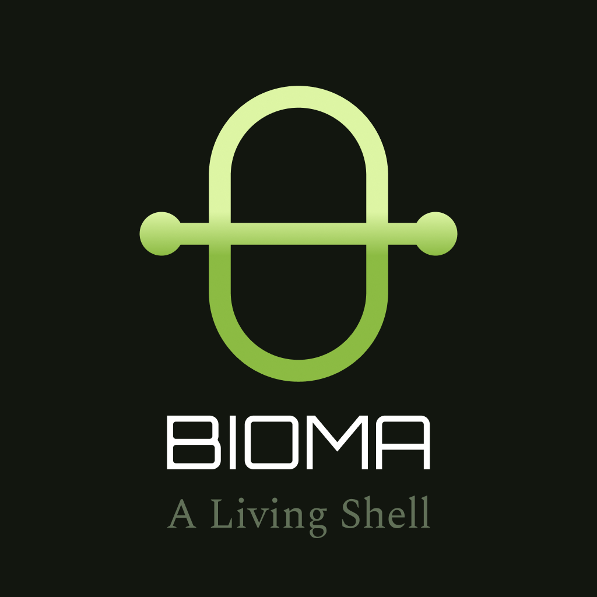
</h1>

A Wayland desktop shell built as independent, living surfaces rather than a bar.

The machine is an organism. Bioma shows its vital signs: surfaces appear when
they have something to say, animate in proportion to what they measure, and go
quiet when nothing is happening.

- **Compositor**: Niri
- **Toolkit**: Quickshell (Qt/QML)
- **Status**: **1.0 beta**. Every cell of the first version is built and in
  daily use, with the settings cell and the launcher. See `PROGRESS.md` for
  what is left and what has not been verified on real hardware

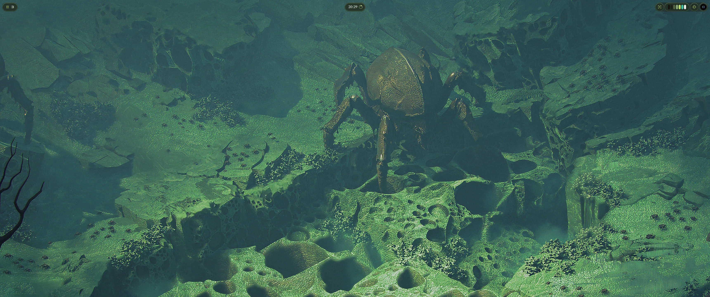

## How it works

### At rest, the interface does not speak

There is no bar. Each edge of a monitor is a **membrane**. A membrane carries
**tissues**, positioned containers, and a tissue carries **cells**, one domain
each: the clock, the workspaces, audio, the machine's vitals. At rest a cell is
its glyph and nothing more. No percentages, no counters, no figures. The clock,
the window title, the track playing and a notification are the only things
that are ever written out.

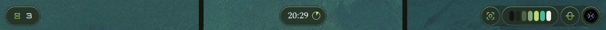

A cell exists when it has something to say. A cell can be set to be always
there, or to appear only when something happens: the workspaces when you
change one, audio when the volume moves, vitals when a reading turns critical.

<p align="center">
  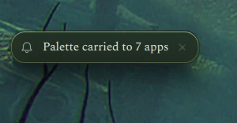
</p>

### Movement means something

Every animation encodes a live value in its rate or its extent. A ring fills
as far as the load it measures; a bar breathes as fast as the audio it hears.
Motion at a fixed rate with no data behind it is decoration, and Bioma has
none: an indicator with nothing to report is still, or absent. Colour says
state (calm, active, alert), and form says domain.

### Expanded forms grow from their origin

Opening a cell grows it out of the place it sits, shape by shape, joined by
threads. Nothing appears from nowhere, and nothing scales: shapes grow by
width and height, so the lit border and the radii stay true while they move.

<p align="center">
  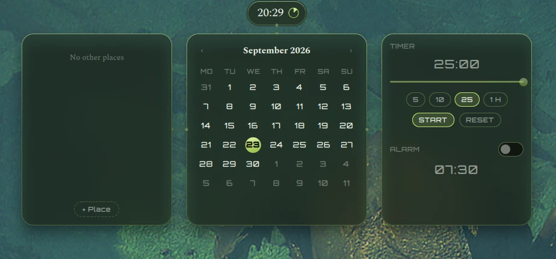
</p>

<p align="center">
  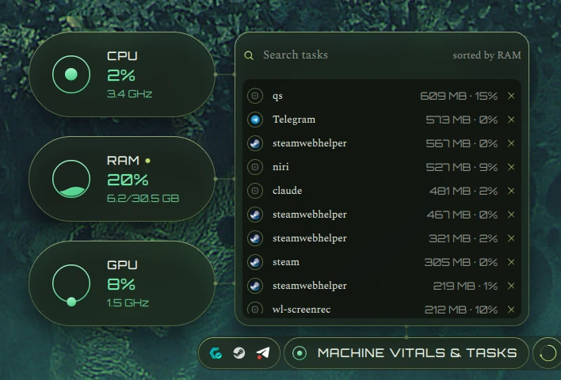
  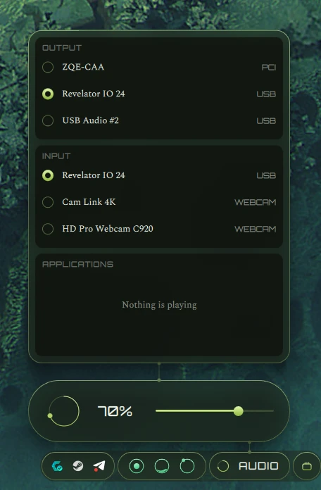
</p>

<p align="center">
  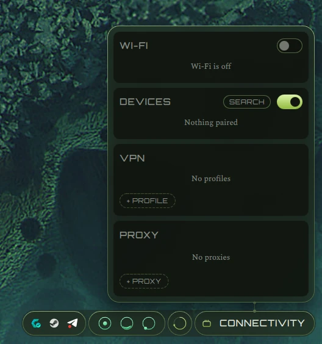
  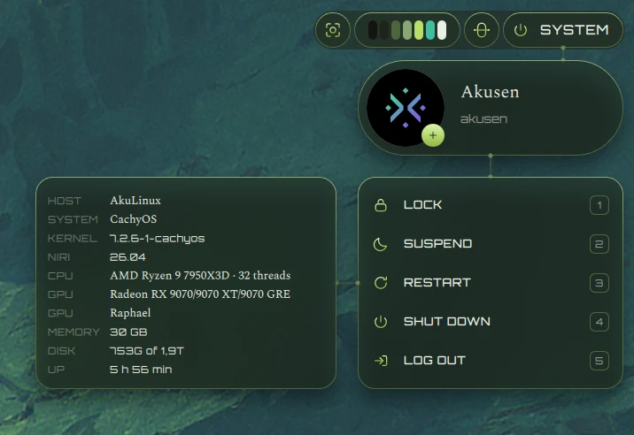
</p>

<p align="center">
  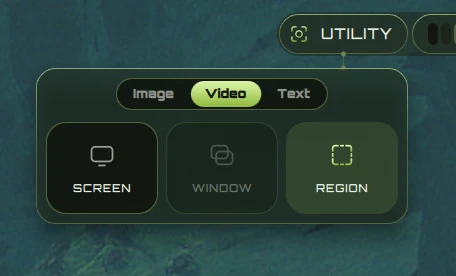
  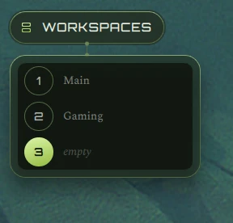
  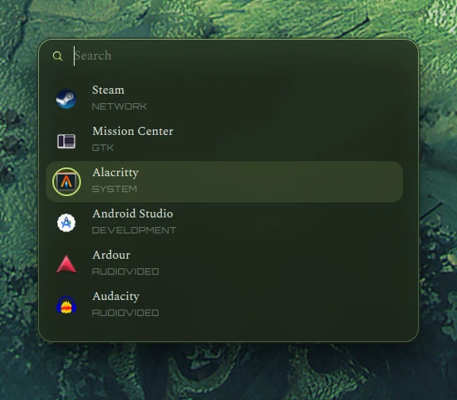
</p>

Every cell also answers a key. A cell placed on a membrane opens there, and a
cell placed nowhere opens floating: in the middle of the screen, at a corner,
or at the pointer.

### One palette, the whole desktop

A palette has four roles (background, text, primary, secondary), and every
surface derives from them. It is either one of Bioma's own palettes or computed
from the wallpaper by matugen. The theme cell switches it live. Colour is an
animated value rather than a constant copied into each cell, so the whole shell
changes colour at once.

<p align="center">
  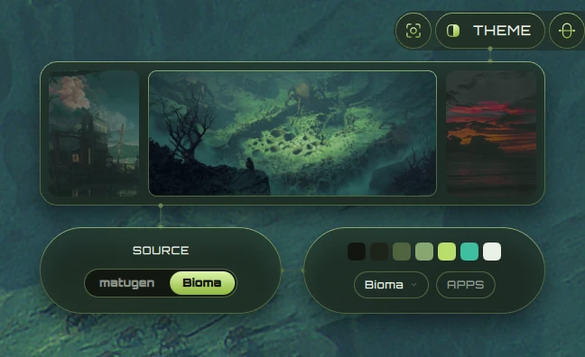
</p>

A new wallpaper and palette, picked in the theme cell, retint the whole shell as
it runs:

https://github.com/user-attachments/assets/c816f39e-bda5-46b9-a476-74eb5cc4e5eb

The same palette goes past the shell into the rest of the desktop. It sets
niri's focus ring and borders, and rounds niri's windows to the shell's radius.
It also themes GTK, Qt, and the terminals and tools that have a template:
Alacritty, btop, cava, Kitty, Foot, Ghostty and more, chosen under APPS in the
theme cell.

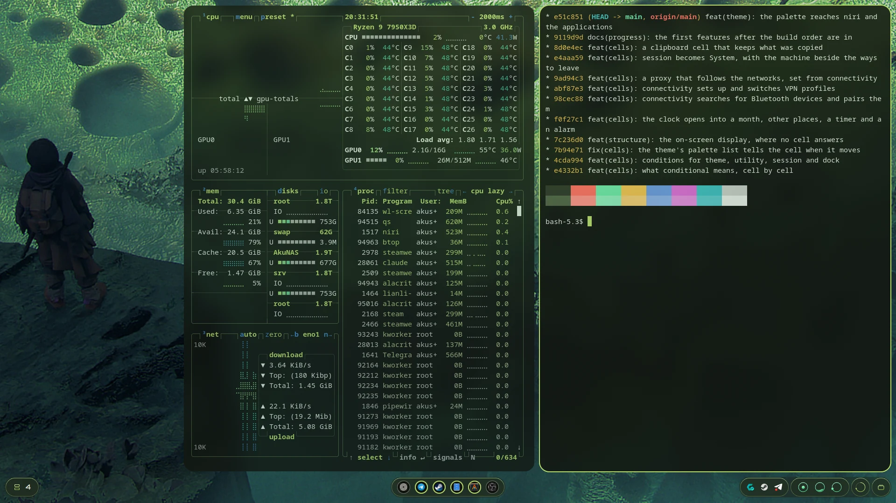

### Settings, in the shell

The layout is edited from the shell itself, with no config file to write by
hand. The settings cell has five pages: Appearance, Structure (which cell goes
where, on each monitor), Cells (always or conditional), Monitors and Keybinds.
Adding a cell costs one block of configuration, and the Structure page writes
that block for you.

<p align="center">
  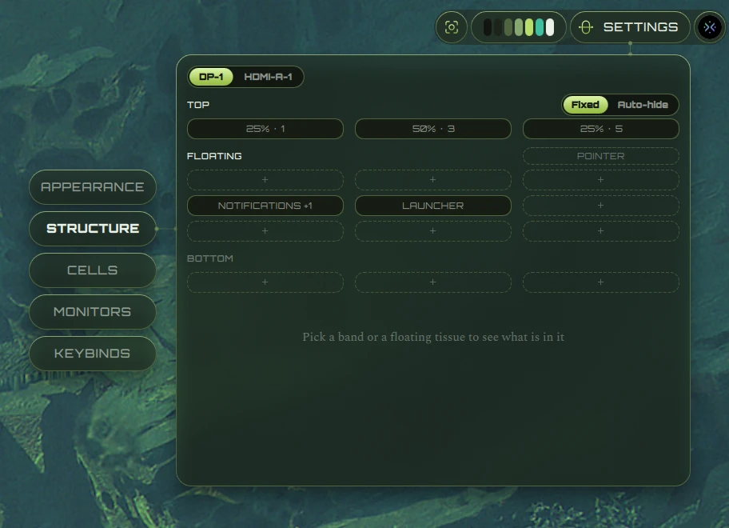
  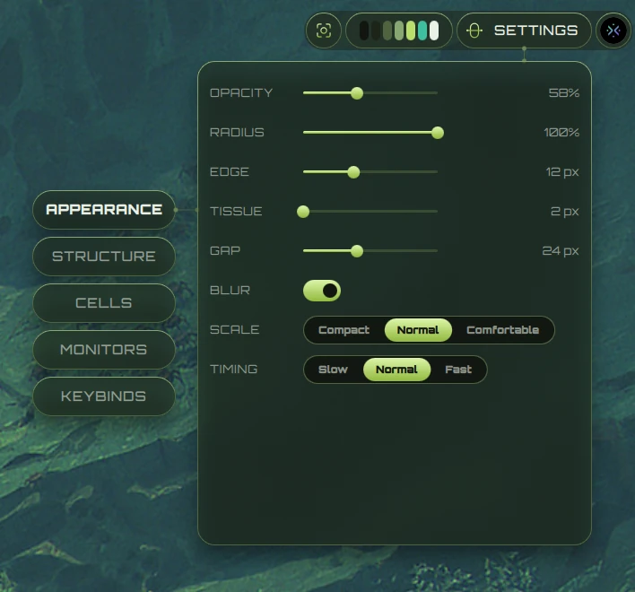
</p>

Every change applies as it is made. Here the radius goes from round to square,
and every cell follows:

https://github.com/user-attachments/assets/b6040d46-5f7f-4733-bbe6-13055976d951

## Requirements

Bioma is written for **niri** and **Quickshell 0.3.1**, and it is tested on Arch
Linux (CachyOS). Package names below are Arch's.

| Required | Package | For |
|---|---|---|
| niri 26.04 or later | `niri` | the compositor; 26.04 is the first with `ext-background-effect` blur |
| Quickshell 0.3.1 | `quickshell` | the shell runtime |
| Python 3 | `python` | the helper scripts in `scripts/` |
| gsettings | `glib2` | the desktop's settings: palette, icons, cursor, proxy |
| wl-clipboard | `wl-clipboard` | the clipboard cell |
| ImageMagick | `imagemagick` | wallpaper thumbnails |

| Optional | Package | For |
|---|---|---|
| matugen | `matugen` | palettes computed from the wallpaper |
| grim, tesseract | `grim`, `tesseract` | screenshots and text recognition |
| wl-screenrec or wf-recorder | `wl-screenrec`, `wf-recorder` | screen recording (VAAPI; the second is the fallback) |
| NetworkManager | `networkmanager` | Wi-Fi, wired, VPN profiles, proxy triggers |
| BlueZ | `bluez`, `bluez-utils` | Bluetooth |
| ddcutil | `ddcutil` | the brightness of external monitors |
| PipeWire | `pipewire` | audio, and the alarm's sound |
| UPower | `upower` | the battery, on a laptop |
| pciutils, libnotify | `pciutils`, `libnotify` | the graphics card in the System cell; timer and alarm notifications |
| Spectral, Orbitron | `ttf-spectral`, AUR `ttf-orbitron` | the two voices, expressive and technical. Declared as roles, so their absence degrades rather than breaks. Both are SIL OFL, and the Google Fonts families dropped into `~/.local/share/fonts` work too |

## Install

```sh
git clone https://github.com/AkusenArcade/Bioma.git
cd Bioma
scripts/install --autostart
```

`scripts/install` says what is missing first, and stops if anything required is.
Then it writes the keys and tells niri where Bioma is:

- `bioma-binds.kdl`, next to niri's `config.kdl`, from
  `config/niri/bioma-binds.kdl.in` with the repository's path filled in. The
  keys are under `Mod+Alt`, so they stay clear of niri's own defaults. The copy
  is yours: the settings cell's Keybinds page edits it, and the installer
  leaves it alone from then on (`--force` writes it again).
- `include` lines at the end of `config.kdl` for that file and for
  `config/niri/bioma.kdl`, the layer rules. With `--autostart`, it also adds a
  `spawn-at-startup` for `scripts/shell start`.

`config.kdl` is copied aside first, and the result goes through `niri validate`.
If niri refuses it, the copy is put back. Running the installer again changes
nothing.

Then start it with `scripts/shell bioma`, or log in again. The first start uses
`config/default.json`. Everything after that is set from the settings cell
(`Mod+Alt+S`) and kept in `~/.config/bioma/override.json`.

### Keys

| Key | Opens |
|---|---|
| `Mod+Space` | the launcher |
| `Mod+Alt+S` | settings |
| `Mod+Alt+T` | theme: wallpaper, palette, icons, cursor, application templates |
| `Mod+Alt+V` | vitals and tasks |
| `Mod+Alt+A` | audio |
| `Mod+Alt+P` | capture and recording |
| `Mod+Alt+K` | keyboard layouts |
| `Mod+Alt+Escape` | system: the account, the machine, the ways to leave |
| `Mod+Shift+Space` | the next keyboard layout |
| `Print` | a screenshot of a region, drawn with Bioma's own rectangle |
| `Mod+Print` | a screenshot of the monitor the keyboard is on |
| `Mod+Alt+B` | switch between Bioma and the other shell |

The volume, brightness and media keys go to Bioma too. Every other cell also
answers `qs -p /path/to/Bioma/shell.qml ipc call cell toggle <name>`, so any
key can be given to any cell from the Keybinds page. Escape, or a press
anywhere else, closes what is open.

**Bioma has no lock screen yet.** The System cell's LOCK stays unavailable until
`session.lock` in `~/.config/bioma/override.json` names a locker, for example
`["hyprlock"]` or `["swaylock", "-f"]`.

## Running

```sh
scripts/bioma
```

Quickshell also loads a configuration by directory name, and that works too:

```sh
ln -s "$PWD" ~/.config/quickshell/bioma
quickshell -c bioma
```

The script sets two things for this process. The first is `QT_QPA_PLATFORMTHEME`,
set to `xdgdesktopportal`. Bioma draws every pixel it shows, so a
platform theme has nothing to style here — except the file picker the system
cell opens, which is Qt's own `FileDialog`. Qt asks the platform theme for a
native dialog and draws its own when there is none, and `qt6ct`, a common
choice for everything else on a machine, provides none. Started any other way
the shell still works and the picker is Qt's, which looks like nothing else on
the screen. Set `BIOMA_PLATFORMTHEME` to override it.

The second is `QS_ICON_THEME`, read from the desktop's icon theme
(`org.gnome.desktop.interface icon-theme`). That platform theme does not pass
the icon theme on, and without it Qt looks only in hicolor. An application's
own icon is still found there, but a themed icon, such as a folder or a
device, is not. Quickshell reads the variable once, at start: an icon theme
chosen in the theme cell reaches the shell's own icons at its next start.

## Two shells, one session

One program per session may own `org.freedesktop.Notifications`, so Bioma and
whatever was there before cannot both run. `scripts/shell` is the switch:

```sh
scripts/shell            # what is running, and what will run at login
scripts/shell bioma      # stop the other, start Bioma, remember it
scripts/shell noctalia   # the other way
scripts/shell toggle     # whichever is not running now
scripts/shell start      # start what was remembered — the line niri spawns
```

The choice lives in `~/.config/bioma/shell`, outside the repository: it is a
fact about a machine's session, not about the project. `Mod+Alt+B` is the same
toggle on a key.

## Verifying a service without a UI

```sh
qs -p "$PWD/probe.qml"
```

Creates no surfaces. It binds each service the way a cell would, waits for the
data to arrive, prints what came back, and exits. Every service is verified
through this before a cell is built on it.

## Layout

```
shell.qml          entry point
probe.qml          headless service verification
core/              Config, Theme, Timing, Metrics — global singletons
structure/         Membrane, Tissue, Cell — the layout engine
components/        shared primitives
services/          one singleton per system domain
cells/<name>/      one directory per cell
config/            default.json + palettes/
assets/icons/      the 33 glyphs, at runtime
docs/              bioma-prd.md — the specification
docs/design/       the visual specification: style guide, cells, tokens, mockups
docs/media/        the logo, and the screenshots in this file (tools/showcase
                   takes them)
tools/             development tools
```

## Configuration

Two layers. `config/default.json` ships with the shell; a user override file
written by the settings UI is loaded last and wins. The default is functional
and demonstrates the vocabulary — it is not exhaustive.

## Trying it on one monitor

`org.freedesktop.Notifications` has one owner per session, so Bioma and another
shell cannot both show notifications — `scripts/shell` above switches between
them. To try Bioma beside another shell without switching, declare a membrane
on a monitor the other shell does not occupy in `~/.config/bioma/override.json`,
then

```sh
qs -p "$PWD/shell.qml"
```

## Documentation

- `docs/bioma-prd.md` — the product requirements, and the source of truth
- `docs/design/` — the visual specification: `STYLE_GUIDE.md`, `CELLS.md`,
  `IMPLEMENTATION.md`, `tokens.css`, the icon set and 68 mockups
- `PROGRESS.md` — where the work stands, and what is not done
- `services/INVENTORY.md` — the Prisma inventory and every decision taken since
- `CLAUDE.md` — architecture rules for anyone (or anything) writing code here

## Licence

GPL-3.0-or-later. See `LICENSE`.

The design material in `docs/design/` — the style guide, the cell
specifications, the icons and the mockups — is part of the same work and
travels under the same terms.
