<h1 align="center">
  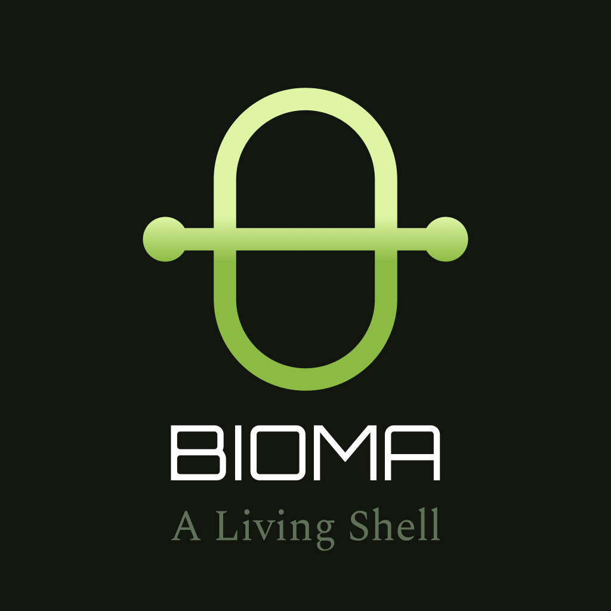
</h1>

A Wayland desktop shell built as independent, living surfaces rather than a bar.

The machine is an organism. Bioma shows its vital signs: surfaces appear when
they have something to say, animate in proportion to what they measure, and go
quiet when nothing is happening.

- **Compositor**: Niri
- **Toolkit**: Quickshell (Qt/QML)
- **Status**: **1.0 beta**. Every cell of the first version is built and in
  daily use, with the settings cell and the launcher. See `PROGRESS.md` for
  what is left and what has not been verified on real hardware

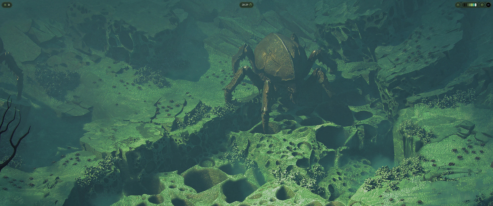

## How it works

### At rest, the interface does not speak

There is no bar. Each edge of a monitor is a **membrane**. A membrane carries
**tissues**, positioned containers, and a tissue carries **cells**, one domain
each: the clock, the workspaces, audio, the machine's vitals. At rest a cell is
its glyph and nothing more. No percentages, no counters, no figures. The clock,
the window title, the track playing and a notification are the only things
that are ever written out.

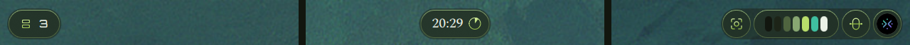

A cell exists when it has something to say. A cell can be set to be always
there, or to appear only when something happens: the workspaces when you
change one, audio when the volume moves, vitals when a reading turns critical.

<p align="center">
  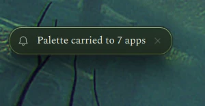
</p>

### Movement means something

Every animation encodes a live value in its rate or its extent. A ring fills
as far as the load it measures; a bar breathes as fast as the audio it hears.
Motion at a fixed rate with no data behind it is decoration, and Bioma has
none: an indicator with nothing to report is still, or absent. Colour says
state (calm, active, alert), and form says domain.

### Expanded forms grow from their origin

Opening a cell grows it out of the place it sits, shape by shape, joined by
threads. Nothing appears from nowhere, and nothing scales: shapes grow by
width and height, so the lit border and the radii stay true while they move.

<p align="center">
  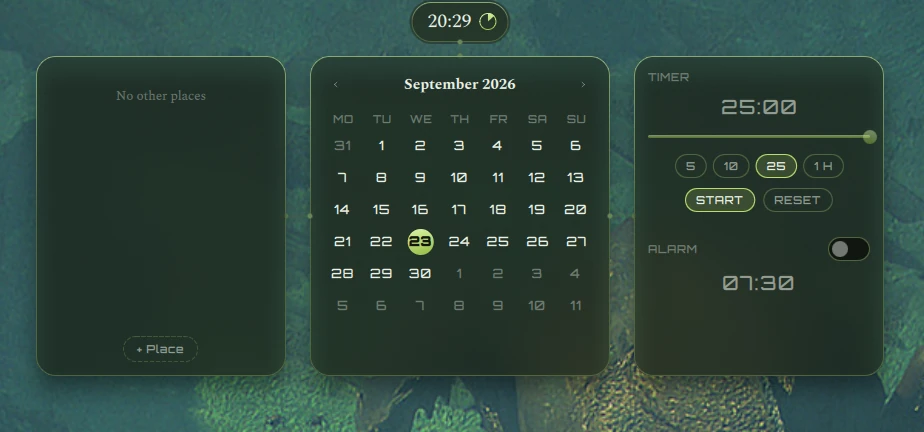
</p>

<p align="center">
  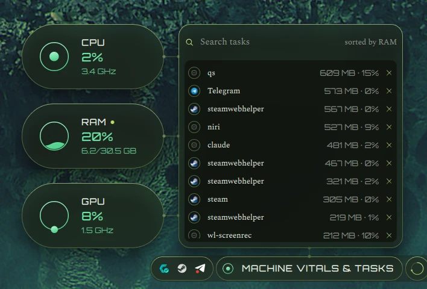
  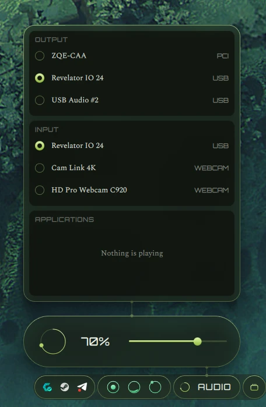
</p>

<p align="center">
  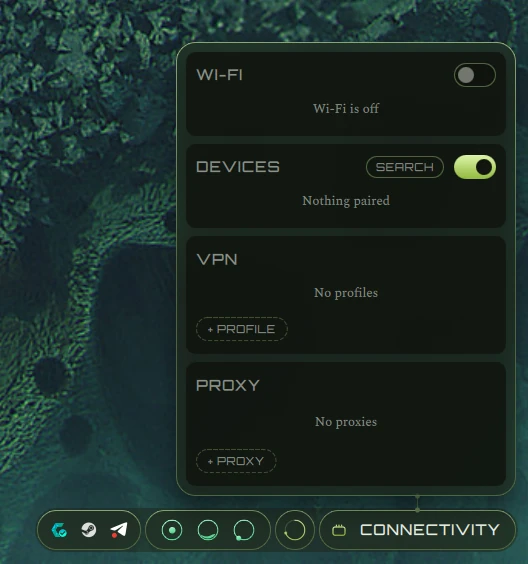
  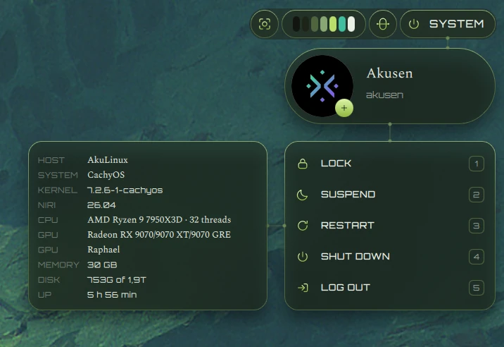
</p>

<p align="center">
  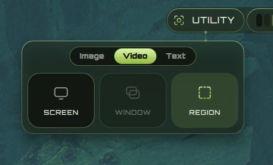
  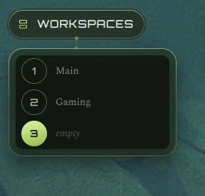
  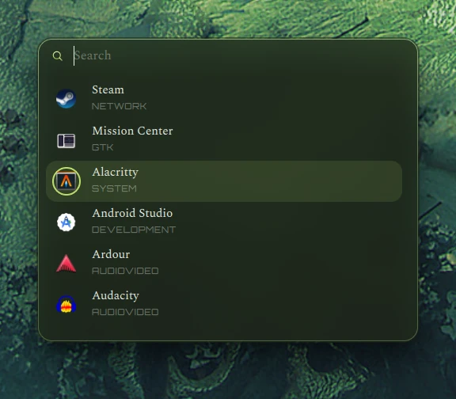
</p>

Every cell also answers a key. A cell placed on a membrane opens there, and a
cell placed nowhere opens floating: in the middle of the screen, at a corner,
or at the pointer.

### One palette, the whole desktop

A palette has four roles (background, text, primary, secondary), and every
surface derives from them. It is either one of Bioma's own palettes or computed
from the wallpaper by matugen. The theme cell switches it live. Colour is an
animated value rather than a constant copied into each cell, so the whole shell
changes colour at once.

<p align="center">
  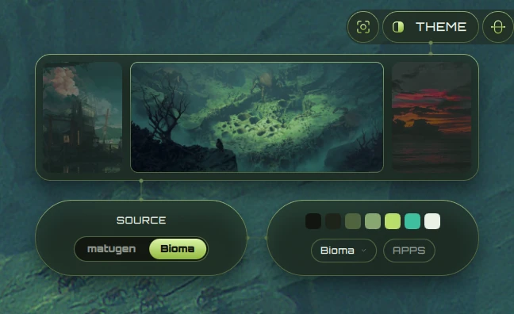
</p>

A new wallpaper and palette, picked in the theme cell, retint the whole shell as
it runs:

https://github.com/user-attachments/assets/c816f39e-bda5-46b9-a476-74eb5cc4e5eb

The same palette goes past the shell into the rest of the desktop. It sets
niri's focus ring and borders, and rounds niri's windows to the shell's radius.
It also themes GTK, Qt, and the terminals and tools that have a template:
Alacritty, btop, cava, Kitty, Foot, Ghostty and more, chosen under APPS in the
theme cell.

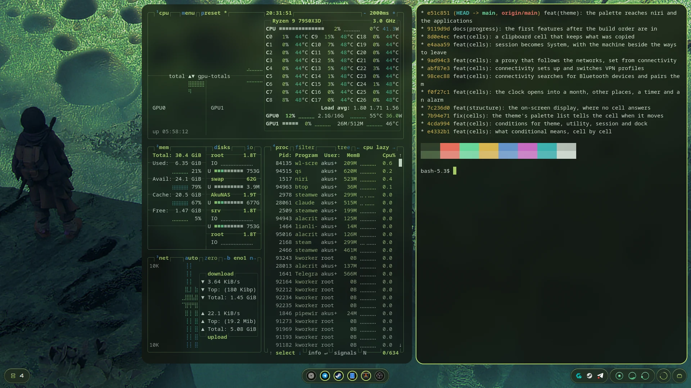

### Settings, in the shell

The layout is edited from the shell itself, with no config file to write by
hand. The settings cell has five pages: Appearance, Structure (which cell goes
where, on each monitor), Cells (always or conditional), Monitors and Keybinds.
Adding a cell costs one block of configuration, and the Structure page writes
that block for you.

<p align="center">
  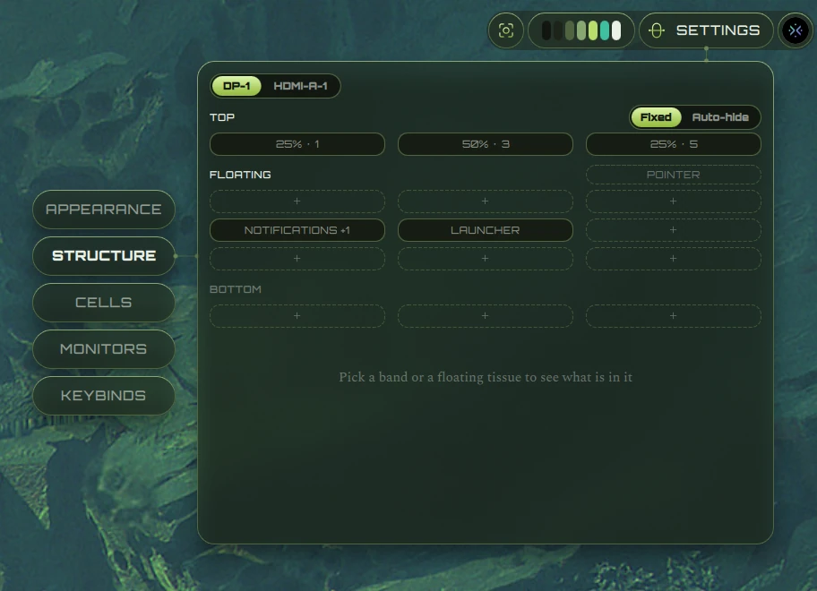
  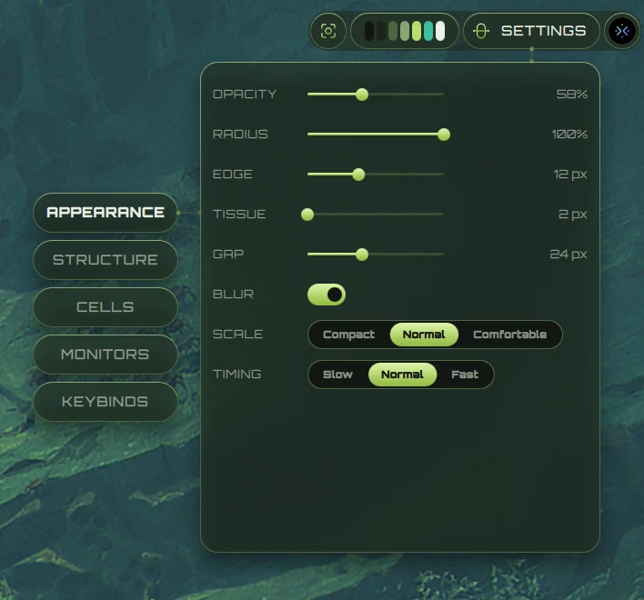
</p>

Every change applies as it is made. Here the radius goes from round to square,
and every cell follows:

https://github.com/user-attachments/assets/b6040d46-5f7f-4733-bbe6-13055976d951

## Requirements

Bioma is written for **niri** and **Quickshell 0.3.1**, and it is tested on Arch
Linux (CachyOS). Package names below are Arch's.

| Required | Package | For |
|---|---|---|
| niri 26.04 or later | `niri` | the compositor; 26.04 is the first with `ext-background-effect` blur |
| Quickshell 0.3.1 | `quickshell` | the shell runtime |
| Qt 5 Compat | `qt6-5compat` | the masks the wallpaper tiles and faces are drawn through (`Qt5Compat.GraphicalEffects`), which Quickshell does not bring |
| Python 3 | `python` | the helper scripts in `scripts/` |
| gsettings | `glib2` | the desktop's settings: palette, icons, cursor, proxy |
| wl-clipboard | `wl-clipboard` | the clipboard cell |
| ImageMagick | `imagemagick` | wallpaper thumbnails |

| Optional | Package | For |
|---|---|---|
| matugen | `matugen` | palettes computed from the wallpaper |
| grim, tesseract | `grim`, `tesseract` | screenshots and text recognition |
| whisper.cpp, its model, python-evdev | `whisper-cpp`, `ggml-vulkan`, AUR `whisper.cpp-model-large-v3-turbo-q5_0`, `python-evdev` | dictation — see [Dictation](#dictation). The AUR package brings all of it |
| wl-screenrec or wf-recorder | `wl-screenrec`, `wf-recorder` | screen recording (VAAPI; the second is the fallback) |
| NetworkManager | `networkmanager` | Wi-Fi, wired, VPN profiles, proxy triggers |
| BlueZ | `bluez`, `bluez-utils` | Bluetooth |
| CUPS, Avahi | `cups`, `avahi` | printers in the connectivity cell: the queues, the default, network printers found and added driverless. Adding and removing one needs CUPS's admin group (`sys` or `wheel` on Arch) |
| Business Network Wizard | AUR `business-network-wizard` | a company network — NTLM proxy, VPN, 802.1X Wi-Fi, shares, printers. When it is installed the connectivity cell's proxy well offers COMPANY NETWORK, which opens it |
| ddcutil | `ddcutil` | the brightness of external monitors |
| PipeWire | `pipewire` | audio, and the alarm's sound |
| UPower | `upower` | the battery, on a laptop |
| pciutils, libnotify | `pciutils`, `libnotify` | the graphics card in the System cell; timer and alarm notifications |
| hyprlock or swaylock | `hyprlock`, `swaylock` | the fallback lock screen, which takes over if Bioma's own fails. Without one, a lock screen that fails leaves only the TTY way back in |
| Spectral, Orbitron | `ttf-spectral`, AUR `ttf-orbitron` | the two voices, expressive and technical. Declared as roles, so their absence degrades rather than breaks. Both are SIL OFL, and the Google Fonts families dropped into `~/.local/share/fonts` work too |

## Install

From the AUR, as `bioma-shell`:

```sh
paru -S bioma-shell          # or yay, or makepkg from packaging/aur
bioma-install --autostart
```

The package puts Bioma in `/usr/share/bioma` and builds the spectrum tool for
Sinestesia. `bioma-install` is `scripts/install` below; run it once per user.
Coming from a clone, it points the existing includes, the autostart line and the
keys at the package, and leaves the keys themselves as they are.

Or from a clone:

```sh
git clone https://github.com/AkusenArcade/Bioma.git
cd Bioma
scripts/install --autostart
```

A clone needs the spectrum tool built once for Sinestesia:
`cargo build --release` in `tools/sinestesia-bands` (see its README).

`scripts/install` says what is missing first, and stops if anything required is.
Then it writes the keys and tells niri where Bioma is:

- `bioma-binds.kdl`, next to niri's `config.kdl`, from
  `config/niri/bioma-binds.kdl.in` with the repository's path filled in. The
  keys are under `Mod+Alt`, so they stay clear of niri's own defaults. The copy
  is yours: the settings cell's Keybinds page edits it, and the installer
  leaves it alone from then on (`--force` writes it again).
- `include` lines at the end of `config.kdl` for that file and for
  `config/niri/bioma.kdl`, the layer rules. With `--autostart`, it also adds a
  `spawn-at-startup` for `scripts/shell start`.

`config.kdl` is copied aside first, and the result goes through `niri validate`.
If niri refuses it, the copy is put back. Running the installer again changes
nothing.

Then start it with `scripts/shell bioma`, or log in again. After an update,
`scripts/shell restart` stops Bioma and starts the new version. The first start uses
`config/default.json`. Everything after that is set from the settings cell
(`Mod+Alt+S`) and kept in `~/.config/bioma/override.json`.

### Keys

| Key | Opens |
|---|---|
| `Mod+Space` | the launcher |
| `Mod+Alt+S` | settings |
| `Mod+Alt+T` | theme: wallpaper, palette, icons, cursor, application templates |
| `Mod+Alt+V` | vitals and tasks |
| `Mod+Alt+A` | audio |
| `Mod+Alt+P` | capture and recording |
| `Mod+Alt+K` | keyboard layouts |
| `Mod+Alt+Escape` | system: the account, the machine, the ways to leave |
| `Mod+Shift+Space` | the next keyboard layout |
| `Print` | a screenshot of a region, drawn with Bioma's own rectangle |
| `Mod+Print` | a screenshot of the monitor the keyboard is on |
| `Alt+Print` | a screenshot of the window that has the focus |
| `Shift+Print` | stop a recording, wherever the utility cell is |
| `Mod+Alt+D` | dictation: press to speak, press again to type it into the focused window |
| `Mod+Alt+L` | lock the session |
| `Mod+Alt+B` | switch between Bioma and the other shell |

The volume, brightness and media keys go to Bioma too. Every other cell also
answers `qs -p /path/to/Bioma/shell.qml ipc call cell toggle <name>`, so any
key can be given to any cell from the Keybinds page. Escape, or a press
anywhere else, closes what is open.

### Dictation

Speech to text, in the utility cell: under **Text** the middle button is
DICTATION, or `Mod+Alt+D` from anywhere. The first press listens, and the cell
shows the open microphone, its level and the seconds spoken. The second press
transcribes, locally, with whisper.cpp, and the text lands in the window that
has the focus. `qs -p shell.qml ipc call capture cancel` drops a take.

The text is **pasted**, not typed. A typed keymap is ignored by Electron
applications, Teams, Obsidian and VS Code among them, and accented letters
arrive as other keys. So the text goes to the clipboard, a real Ctrl+V is
sent from a virtual keyboard (Ctrl+Shift+V in a terminal), and the clipboard
you had is put back.

That keyboard needs `/dev/uinput`. The package installs a udev rule giving it
to the user at the seat, the same rule `steam-devices` ships for game
controllers. Be aware of what that means: **any program you run can then
synthesise keyboard and mouse input.** Without it, dictation still works: the
text is left on the clipboard, and a notification says to paste it.

The model is `large-v3-turbo`, quantised (547 MB). It runs on the GPU through
Vulkan when there is one, and on the CPU otherwise.
`capture.dictation` in the configuration picks another model, the language,
and the terminals that paste with Ctrl+Shift+V.

### The lock screen

Bioma's lock screen is `lock.qml`, a process of its own, so a shell that
falls over does not take the lock with it. It shows the wallpaper blurred, the
time and date, who is logged in and the password field, on the screen the
keyboard is on. It locks when asked — `Mod+Alt+L`, the System cell's LOCK, or
anything that runs `loginctl lock-session` — before a suspend, and after a time
idle, set on the Session page of the settings cell.

The password is checked by PAM with Bioma's own file, `assets/pam/bioma-lock`:
`pam_unix` alone, without the failure counter `login` has, so mistyping at the
lock screen never locks the account.

`scripts/lock` starts it and stands guard. If the lock does not take within
five seconds, or dies while it holds the screens, hyprlock (or swaylock) takes
over with a plain field. The worst case is a plainer lock screen.

#### If the lock screen fails

If neither is installed, or both fail, niri keeps the screens locked, red, with
nothing to type into. Nothing is lost; the way back is a text console:

1. Press `Ctrl+Alt+F2` and log in.
2. Start a lock screen on the running session, then return to it with
   `Ctrl+Alt+F1` and type the password:

   ```sh
   WAYLAND_DISPLAY=wayland-1 hyprlock
   ```

   niri's socket is usually `wayland-1`; `ls /run/user/$(id -u)` shows it.

   Or, to end the session instead: `niri msg --socket "$(ls /run/user/$(id -u)/niri.wayland-1.*.sock)" action quit -s`.

### The greeter

Bioma can also greet you before you log in. The greeter is the lock screen's
composition, with greetd checking the password: the same wallpaper and mode
(span included), palette, faces, appearance and clock. The field is on the
primary monitor only, the one `focus-at-startup` marks in niri's outputs.

The greeter runs as the `greeter` user and cannot read your home, so it runs
from a copy. The shell keeps that copy current by itself: the configuration,
the wallpaper, the palette, the monitors, the keyboard layout, the cursor and
your picture. It needs greetd, and three steps with sudo, once:

1. A directory you write and the greeter reads:

   ```sh
   sudo install -d -m 2750 -o "$USER" -g greeter /var/lib/bioma-greeter
   scripts/greeter-sync
   ```

2. Keep the current greeter's configuration as the way back:

   ```sh
   sudo cp /etc/greetd/config.toml /etc/greetd/config.toml.before-bioma
   ```

3. Point greetd at Bioma's greeter, in `/etc/greetd/config.toml`:

   ```toml
   [default_session]
   command = "/var/lib/bioma-greeter/live/shell/scripts/greeter-session"
   user = "greeter"
   ```

It takes effect at the next login screen. If the greeter does not come up, it
writes why to `/tmp/bioma-greeter.log`. To go back, log in on a text console
(`Ctrl+Alt+F2`) and restore the old configuration:

```sh
sudo cp /etc/greetd/config.toml.before-bioma /etc/greetd/config.toml
sudo systemctl restart greetd
```

## Running

```sh
scripts/bioma
```

Quickshell also loads a configuration by directory name, and that works too:

```sh
ln -s "$PWD" ~/.config/quickshell/bioma
quickshell -c bioma
```

The script sets two things for this process. The first is `QT_QPA_PLATFORMTHEME`,
set to `xdgdesktopportal`. Bioma draws every pixel it shows, so a
platform theme has nothing to style here — except the file picker the system
cell opens, which is Qt's own `FileDialog`. Qt asks the platform theme for a
native dialog and draws its own when there is none, and `qt6ct`, a common
choice for everything else on a machine, provides none. Started any other way
the shell still works and the picker is Qt's, which looks like nothing else on
the screen. Set `BIOMA_PLATFORMTHEME` to override it.

The second is `QS_ICON_THEME`, read from the desktop's icon theme
(`org.gnome.desktop.interface icon-theme`). That platform theme does not pass
the icon theme on, and without it Qt looks only in hicolor. An application's
own icon is still found there, but a themed icon, such as a folder or a
device, is not. Quickshell reads the variable once, at start: an icon theme
chosen in the theme cell reaches the shell's own icons at its next start.

## Two shells, one session

One program per session may own `org.freedesktop.Notifications`, so Bioma and
whatever was there before cannot both run. `scripts/shell` is the switch:

```sh
scripts/shell            # what is running, and what will run at login
scripts/shell bioma      # stop the other, start Bioma, remember it
scripts/shell noctalia   # the other way
scripts/shell toggle     # whichever is not running now
scripts/shell start      # start what was remembered — the line niri spawns
```

The choice lives in `~/.config/bioma/shell`, outside the repository: it is a
fact about a machine's session, not about the project. `Mod+Alt+B` is the same
toggle on a key.

## Notifications from Flatpak applications

A sandboxed application — a Flatpak such as Teams for Linux — does not call
`org.freedesktop.Notifications` itself. It asks the notification portal, and
the portal hands the notification to a backend. The `gnome` backend passes it
to GNOME Shell (`org.gtk.Notifications`). Under niri nothing owns that name,
so the notification is lost: Bioma never sees it, and nothing is logged except
a line from `xdg-desktop-portal-gnome`:

```
Error from gnome-shell: Cannot invoke method; proxy is for the well-known name org.gtk.Notifications without an owner
```

The `gtk` backend forwards to `org.freedesktop.Notifications`, which is Bioma.
niri's own portal configuration already chooses it. A
`~/.config/xdg-desktop-portal/niri-portals.conf` of your own, however, replaces
that file whole, and one written for screen casting usually leaves the line
out. Add the last two lines to its `[preferred]` section, next to whatever it
already sets:

```ini
[preferred]
default=gnome;gtk
org.freedesktop.impl.portal.Notification=gtk
org.freedesktop.impl.portal.Access=gtk
```

The portal reads its configuration once, at start:

```sh
systemctl --user restart xdg-desktop-portal
```

A screen cast or a camera shared through the portal is dropped by the restart.

## Verifying a service without a UI

```sh
qs -p "$PWD/probe.qml"
```

Creates no surfaces. It binds each service the way a cell would, waits for the
data to arrive, prints what came back, and exits. Every service is verified
through this before a cell is built on it.

## Layout

```
shell.qml          entry point
probe.qml          headless service verification
core/              Config, Theme, Timing, Metrics — global singletons
structure/         Membrane, Tissue, Cell — the layout engine
components/        shared primitives
services/          one singleton per system domain
cells/<name>/      one directory per cell
config/            default.json + palettes/
assets/icons/      the 33 glyphs, at runtime
docs/              bioma-prd.md — the specification
docs/design/       the visual specification: style guide, cells, tokens, mockups
docs/media/        the logo, and the screenshots in this file (tools/showcase
                   takes them)
tools/             development tools
```

## Configuration

Two layers. `config/default.json` ships with the shell; a user override file
written by the settings UI is loaded last and wins. The default is functional
and demonstrates the vocabulary — it is not exhaustive.

## Trying it on one monitor

`org.freedesktop.Notifications` has one owner per session, so Bioma and another
shell cannot both show notifications — `scripts/shell` above switches between
them. To try Bioma beside another shell without switching, declare a membrane
on a monitor the other shell does not occupy in `~/.config/bioma/override.json`,
then

```sh
qs -p "$PWD/shell.qml"
```

## Documentation

- `docs/bioma-prd.md` — the product requirements, and the source of truth
- `docs/design/` — the visual specification: `STYLE_GUIDE.md`, `CELLS.md`,
  `IMPLEMENTATION.md`, `tokens.css`, the icon set and 68 mockups
- `PROGRESS.md` — where the work stands, and what is not done
- `services/INVENTORY.md` — the Prisma inventory and every decision taken since
- `CLAUDE.md` — architecture rules for anyone (or anything) writing code here

## Licence

GPL-3.0-or-later. See `LICENSE`.

The design material in `docs/design/` — the style guide, the cell
specifications, the icons and the mockups — is part of the same work and
travels under the same terms.
